# LDP-Project-3
## Introduction
Welcome to the Real-time Data Classification System! This project aims to create a powerful and dynamic platform for processing and classifying live data streams based on user-defined rules. It leverages modern web technologies and efficient backend solutions to ensure that data is processed with high speed and accuracy, making it ideal for applications that require real-time decision-making and data management.
## Table of Contents
- [🌟 Purpose](#-purpose)
- [✨ Features](#-features)
- [🛠️ Tools & Technologies](#-tools)
- [📥 Installation](#-installation)
- [🚀 Usage](#-usage)
- [📊 Endpoints](#-endpoints)
- [🧪 Testing](#-testing)
- [🖼️ Images](#-images)
- [📄 License](#-license)
## 🌟 Purpose
The primary goal of this project is to provide a scalable, real-time data processing system where users can define their own classification rules. By integrating JWT for secure authentication, a robust database for rule storage, and real-time data streaming capabilities, this project ensures that user-defined rules can be applied promptly to incoming data, making the system suitable for various real-world applications.
## ✨ Features
- **JWT Authentication**
  - Secure access with JSON Web Tokens.
  - Middleware to validate incoming requests.
  - Sign-up and login endpoints for user management.

- **Database Integration**
  - Schema design for storing user and rule data.
  - CRUD operations for managing user-defined classification rules.
  - Integration with a database for persistent storage.

- **User-Defined Classification Rules**
  - Parser to interpret and validate user-defined rules.
  - API endpoints for rule management (create, read, update, delete).

- **Real-time Data Processing**
  - WebSocket or Server-Sent Events (SSE) for live data streaming.
  - Real-time classification engine to process data streams using defined rules.

- **Comprehensive Testing**
  - Unit tests for individual modules.
  - Integration tests for end-to-end system validation.
  - Load testing to ensure system stability under high data volumes.
## 🛠️ Tools & Technologies
- **Backend**: Fastify, Node.js
- **Database**: MongoDB
- **Authentication**: JSON Web Token (JWT)
- **Real-Time Processing**: WebSocket
- **Unit/Integration Testing**: Jest with Supertest
- **Load Testing**: Apache JMeter
- **API Request Platform**: VS Code - Thunder Client
## 📥 Installation
To get started with the Real-time Data Classification API, follow these steps:
#### Clone the repository
```bash
git clone https://github.com/biswojit65/LDP-Project-3.git
cd LDP-Project-3
```
#### Install dependencies using npm
```bash
npm install
```
#### Set up the database
Set up MongoDB and connect it to the application using mongoose
## 🚀 Usage
#### Start the server
```bash
npm start
```
#### API Documentation
You can use tools like Postman/VS Code Thunder Client to interact with the API endpoints listed below.
## 📊 Endpoints
- **Create an User**:
  ```bash
  http://{{host}}:{{port}}/api/signup
  ```
- **Login a user**:
  ```bash
  http://{{host}}:{{port}}/api/login
  ```
- **Create a Rule**:
  ```bash
  http://{{host}}:{{port}}/api/newrules
  ```
- **Get All Rules**:
  ```bash
  http://{{host}}:{{port}}/api/getrules
  ```
- **Update a Rule**:
  ```bash
  http://{{host}}:{{port}}/api/updaterule
  ```
- **Delete a Rule**:
  ```bash
  http://{{host}}:{{port}}/api/deleterule
  ```
- **Applying rules on inputstring**:
  ```bash
  http://{{host}}:{{port}}/api/check
  ```

## 🧪 Testing
Running tests is crucial to ensure that project is working as expected and to catch any potential issues early. Run below coomand to run unit tests , integration tests and see the code covarage for this project
 ```bash
  npm test
 ```
## 🖼️ Images
#### Creating a new User
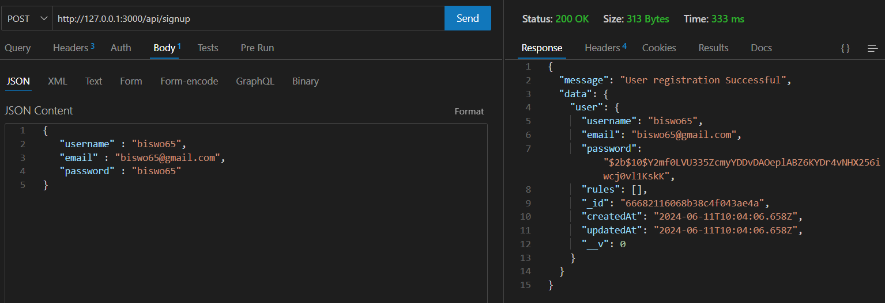
#### Login a User
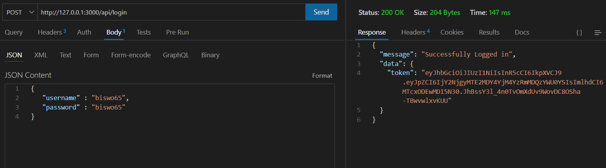
#### Creating a New Rule
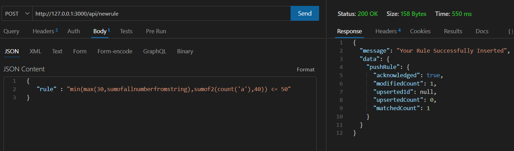
#### Creating anothor New Rule
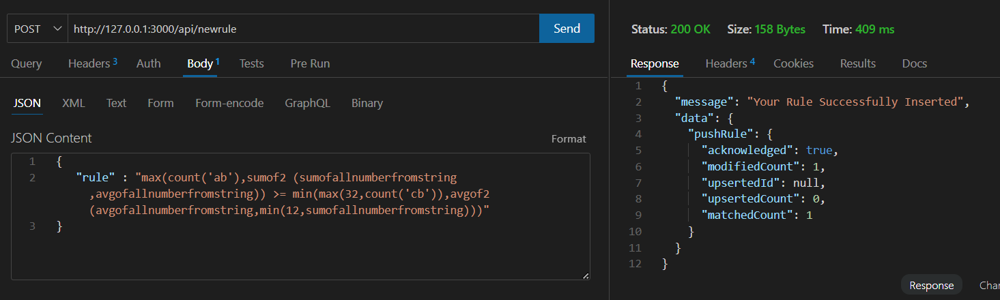
#### Update a Rule
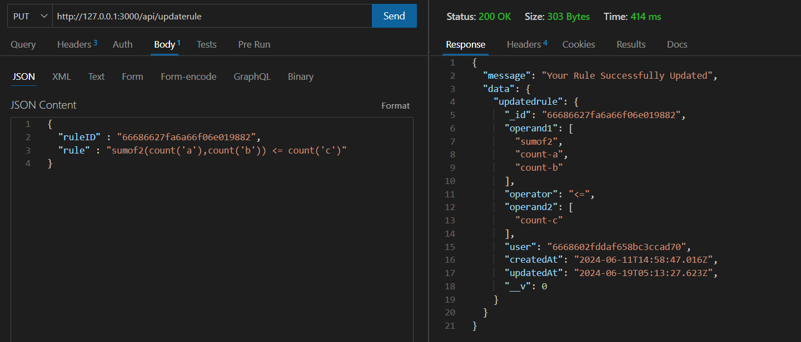
#### Get all the stored Rules for a user
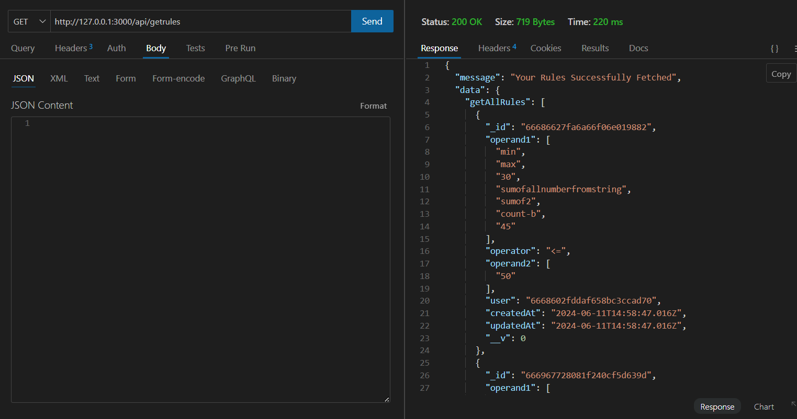
#### Delete a Rule
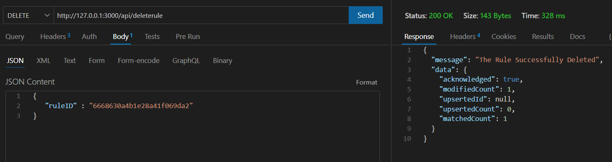
#### Applying rules on inputstring and getting result
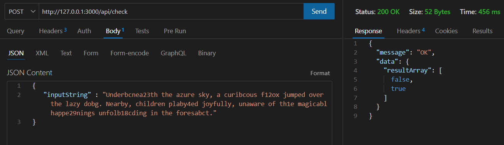
#### Unit Test/Integration Test/Code coverage
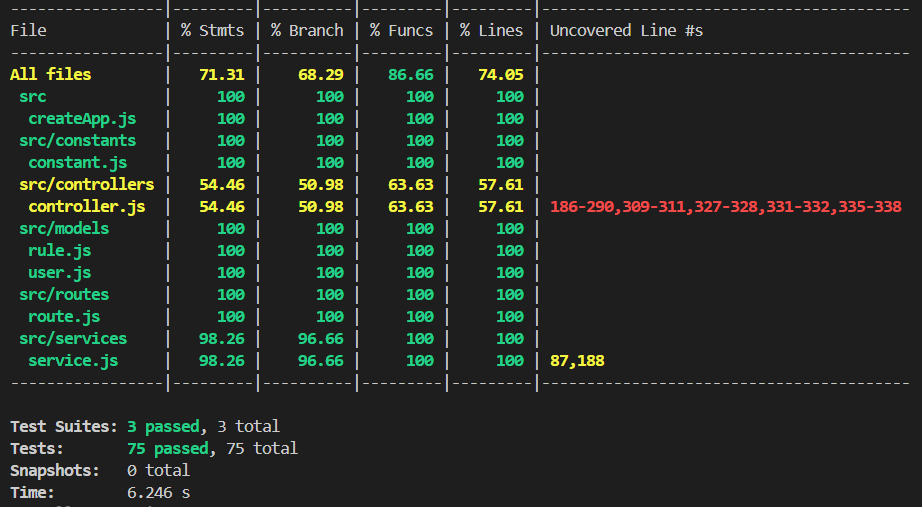
#### Matrices obtained during Load Testing (Ramp up Period-1sec)
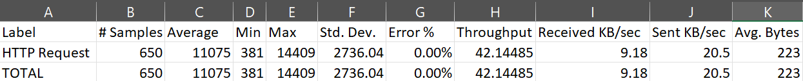
#### Matrices obtained during Load Testing (Ramp up Period-5sec)
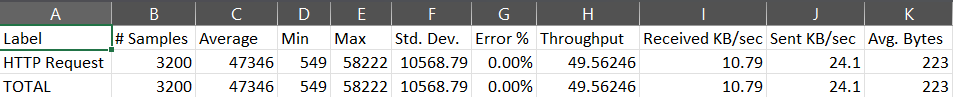
#### WebSocket Data streaming
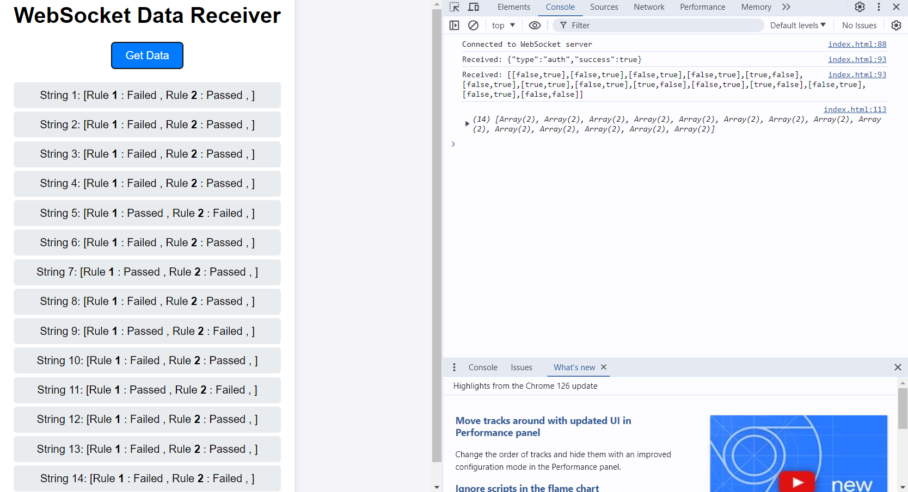
## 📄 License
This project is licensed under the MIT License. See the [LICENSE](LICENSE) file for details.


